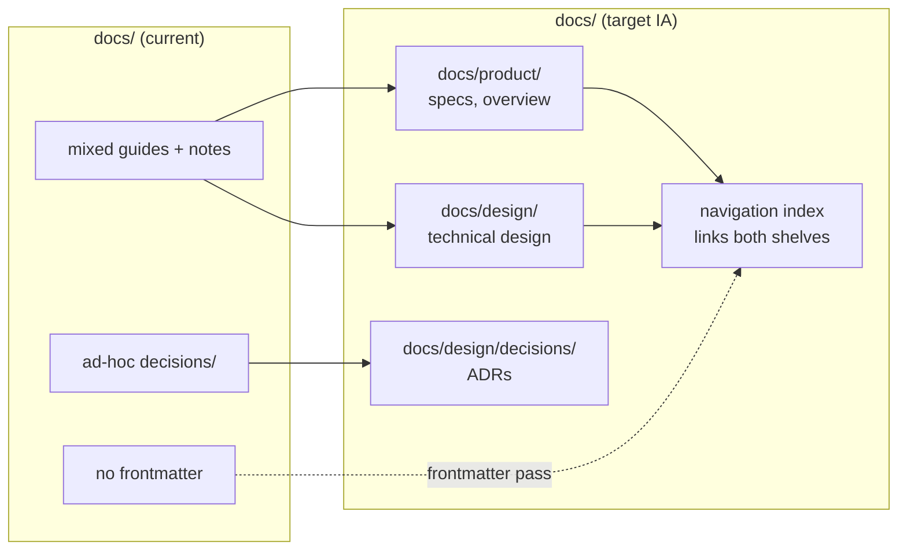

# Documentation refactor to maestro standards

## Summary
The `component-auth` repo predates the maestro documentation standard. This design adopts the two-plane information architecture ([ADR-0025](../../docs/architecture/decisions/0025-managed-product-documentation-standard-and-navigation-ia.md)) — a **Product** shelf (`docs/product/`) and a **Design** shelf (`docs/design/`) — declares the repo's layout in its README, and makes every managed page discoverable by adding the `maestro:` frontmatter block the SpecIndex requires ([ADR-0018](../../docs/architecture/decisions/0018-workspace-read-api-and-frontmatter-index.md)). Existing decision records are migrated to `docs/design/decisions/` and reshaped to the Context / Decision / Consequences standard. The work is purely organisational: content is relocated and re-headed, never re-authored, so no source or runtime behaviour changes. Work is sequenced so the navigation index is rebuilt last, against the final tree.

## Requirements traceability
> The spec's acceptance criteria are referenced by id below. Where the spec is silent on an element this design needs, the gap is raised through the clarify pass rather than assumed.

| AC | Satisfied by |
|---|---|
| AC-1 — repo declares its documentation layout | Task 1 (README layout declaration); §Architecture |
| AC-2 — docs follow the two-plane IA (product / design shelves) | Task 2 (shelf scaffold), Task 3 (migrate pages); §Architecture |
| AC-3 — every managed page carries `maestro:` frontmatter | Task 4 (frontmatter pass); §Data model |
| AC-4 — ADRs conform to the standard one-page format and live under `docs/design/decisions/` | Task 5 (ADR migration + reshape); §Data model |
| AC-5 — a single navigation index links the shelves | Task 6 (navigation index); §Architecture |
| AC-6 — legacy paths remain resolvable during/after migration | Task 3 (alias retention); §Trade-offs |

If any `AC-N` in the approved spec is **not** listed above, it is an unmapped-AC defect — surface it via the clarify pass before the gate, do not skip.

## Architecture
The refactor moves a flat/ad-hoc `docs/` tree into the two-plane layout. No code, build, or runtime component is touched.

The repo README gains a short **Documentation layout** section naming the two shelves and the decisions folder, so agents and humans resolve the architect-preferred paths without guessing. `docs/architecture/` is retained as the legacy alias the index still honours until migration completes (per ADR-0025), then folded into `docs/design/`.

## Data model
The only "entities" here are documents and their frontmatter.

- **Managed page** — a markdown file under a shelf. Stable id = its repo-relative path. Each carries a `maestro:` frontmatter block with at minimum `feature`, `kind`, and a `summary` (≤ 120 words / 800 chars), per [ADR-0018](../../docs/architecture/decisions/0018-workspace-read-api-and-frontmatter-index.md) and [ADR-0021](../../docs/architecture/decisions/0021-plain-language-summary-on-artefacts.md).
- **ADR** — a decision record under `docs/design/decisions/`, named `NNNN-<slug>.md`, numbered monotonically, with sections **Context / Decision / Consequences** (plus *Trade-offs* / *Open questions* where they apply) per [documentation-standards.md](../../docs/guides/documentation-standards.md) §ADRs. Existing accepted ADRs are **moved and reshaped in place** — content preserved, numbering preserved; none are re-decided.
- **Navigation index** — a single page (e.g. `docs/README.md` or the index the SpecIndex expects) linking both shelves. Derived, rebuilt last.

No database, no schema, no wire contract changes.

## API / contracts
None. This feature has no runtime surface. The one machine-readable contract it touches is the **frontmatter shape** consumed by the SpecIndex — frontmatter keys and the `summary` envelope are governed by ADR-0018/ADR-0021 and reused verbatim; this design introduces no new keys.

## Trade-offs
- **Move-and-rehead, not rewrite.** We relocate and add headers rather than rewriting prose. Cost: some migrated pages may read unevenly until a later content pass. Benefit: the refactor is low-risk, reviewable as renames + frontmatter diffs, and changes no meaning.
- **Keep the legacy alias through migration.** We retain `docs/architecture/` as an alias the index honours during the cutover rather than a hard move. Cost: a brief period with two resolvable roots. Benefit: no broken inbound links while pages move (AC-6).
- **No ADR proposed.** Adopting the maestro documentation IA is *applying* an existing accepted standard (ADR-0025/ADR-0018), not a new architectural choice for this repo, so no superseding or new ADR is warranted.

## Task list

| # | Task | Targets | Requirements | Depends on |
|---|---|---|---|---|
| 1 | Add a **Documentation layout** section to the repo README declaring the two shelves and the decisions folder | fps4/component-auth | AC-1 | — |
| 2 | Scaffold the two-plane shelves: create `docs/product/` and `docs/design/` (and `docs/design/decisions/`) with placeholder READMEs | fps4/component-auth | AC-2 | 1 |
| 3 | Migrate existing docs into the correct shelf; retain `docs/architecture/` as the legacy alias until the index is rebuilt | fps4/component-auth | AC-2, AC-6 | 2 |
| 4 | Add the `maestro:` frontmatter block (with `feature`, `kind`, plain-language `summary`) to every managed page | fps4/component-auth | AC-3 | 3 |
| 5 | Move existing decision records to `docs/design/decisions/NNNN-<slug>.md`; reshape each to Context / Decision / Consequences, preserving content and numbering | fps4/component-auth | AC-4 | 2 |
| 6 | Build the navigation index linking both shelves and the decisions folder; retire the legacy alias | fps4/component-auth | AC-5, AC-6 | 3, 4, 5 |

## Notes
- All tasks target the single `component-auth` repo; one repo per task is trivially satisfied for this technical product.
- No new dependencies: the work is markdown + frontmatter only, against the repo's existing docs tooling.
- **Deferred:** a substantive content/copy review of migrated pages is out of scope here (move-and-rehead only) and can be a follow-up product task once the IA is in place.
- **Clarify-pass watch items** to confirm against the approved spec before the gate: (a) the exact canonical index location the spec expects (`docs/README.md` vs a generated index); (b) whether any pages should be split across shelves rather than placed whole; (c) the precise set of pages the spec treats as "managed" for the frontmatter pass.