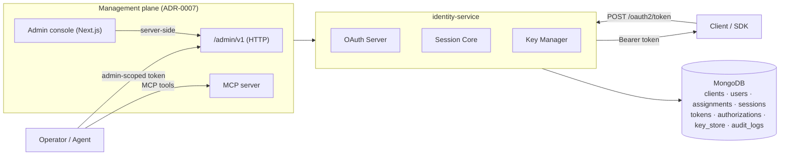

# Architecture

The **identity-service** platform separates authentication responsibilities into a configurable service and lightweight clients so that multiple products can authenticate users and devices in a consistent way. A deployment is one realm with a single shared user pool; OAuth clients (Applications) are the registered per-consumer objects, and users are deployment-scoped and shared across every client (instance-wide SSO — [ADR-0018](decisions/0018-collapse-tenant-into-deployment.md)). Layered on that shared pool, a user must hold an active **assignment** to an application to be issued a token for it, and each application owns its own **role catalogue** ([ADR-0019](decisions/0019-application-assignments-and-app-roles.md)).

## Components

- **Service (`service/`)** – Node.js + Express API hosting OAuth 2.0, legacy session endpoints, and the authenticated `/admin/v1` management plane. It authenticates OAuth clients, persists users, sessions, and token metadata in MongoDB, manages RSA signing keys, issues JWT access tokens for downstream services, and records every management mutation to an append-only audit log.
- **MCP server (`service/src/mcp/`)** – A stdio JSON-RPC server (`npm run mcp`) exposing the management operations as agent tools. A thin protocol adapter over the **same** service layer and the **same** admin-auth + audit path as the HTTP admin API — one authorization model, one audit trail, two transports (ADR-0007).
- **SDK (`sdk/`)** – Headless TypeScript client wrapping the HTTP surface: the OAuth client-credentials helper, the Google login helpers, and the local register/login helpers. No UI; safe server-side.
- **React (`react/`)** – Optional, opt-in package (`@fps4/identity-service-react`) shipping a drop-in `<Login/>` for the local IdP. Separate package so server-side consumers never pull in React.
- **Console (`console/`)** – Optional operator admin console (`@fps4/identity-service-console`, Next.js). A thin **server-side** client over `/admin/v1` — dashboards plus client/user/key management. Holds no DB credentials and never exposes the admin token to the browser (ADR-0007). Distinct from the consumer-facing `<Login/>`.
- **Docs (`docs/`)** – Architecture, API, and configuration references to help consumers integrate quickly.

## High-Level Flow

1. A product backend requests an access token via `POST /oauth2/token` (client credentials). Legacy clients may still call `POST /v1/sessions`.
2. The service authenticates the client and checks its grant and scope registration, then records token/session metadata.
3. JWT access tokens are signed with the active RSA key and embed client (`cid`), optional session (`sid`), and scope claims.
4. Consumers attach the token to downstream API requests. Additional visitor context can be attached later via `PATCH /v1/sessions/{sessionId}`.

## Deployment & Application Model

- A **deployment** (`ds1`, …) is one realm: a single MongoDB, one active signing key, one issuer origin, one Google app, and one shared user pool. Users are deployment-scoped, unique by `email`, and can authenticate against any client in the instance (instance-wide SSO). See [ADR-0018](decisions/0018-collapse-tenant-into-deployment.md).
- OAuth clients (**Applications**) are the registered per-consumer objects; each carries its own grant types, redirect URIs, scopes, and — for user login — an `audience`. Scope policy is per-client; token rate limits and budgets are deployment-wide (`CONFIG.oauth.limits`) and evaluated on every token issuance.
- Each application also owns a **role catalogue** — `roles: [{ key, name?, description? }]`, the set of app-scoped roles that exist for that client. Catalogues are seed-bootstrapped (GitOps baseline) **and** runtime-editable through the management plane; the live DB is authoritative ([ADR-0019](decisions/0019-application-assignments-and-app-roles.md)).
- Session metadata remains available for use cases that rely on `/v1/sessions`, and session IDs continue to flow through access tokens as `sid` when present.
- Allowed browser origins are the deployment's `CORS_ORIGINS` setting — a static, deployment-wide list, not per-consumer documents.

### Entitlement & assignments (ADR-0019)

- Layered on the shared user pool, a **user↔application assignment** governs entitlement: an `assignments` document (one per `{userId, clientId}` pair) records the app-scoped `roles` granted to that user and a `status` (`active` | `suspended`). This does **not** reintroduce Tenant — the realm and user pool stay single and shared.
- **Issuance is gated, globally.** For every user grant (`password`, `authorization_code`, and `refresh_token`), after the user authenticates, token issuance requires an `active` assignment for the target client; otherwise the request fails `access_denied` ("user is not assigned to this application"). Refresh re-reads the assignment, so revoking or suspending it kills further tokens — the same guarantee `assertUserActive` gives for disabled users. Client-credentials (machine) tokens are **unaffected** — they have no user, so assignments do not apply.
- The token's **`roles` claim is app-scoped**, sourced from `assignment.roles` (a subset of the client's catalogue), not from a deployment-wide `user.roles` — that field is **removed** (ADR-0019 reworks ADR-0010's global operator role: `platform_admin` is now a role in the `identity-console` app's catalogue, held via an assignment, and `ADMIN_OPERATOR_ROLES` still maps it to admin authority).
- Assignments are created by operators on the management plane, or by **invites** — an invite now pins a target `clientId` + `roles`, so redeeming it provisions the user **and** the assignment in one step (ADR-0019 reworks ADR-0013).

## Deployment

- The service runs as a stateless container driven entirely by environment variables (`service/.env.example` documents all knobs).
- MongoDB is the only persistent dependency. `docker/compose.yaml` paired with the dev/prod overlays (`docker/compose.dev.yaml`, `docker/compose.prod.yaml`) provisions Mongo and the service for local development and the deployment workflow.
- RSA signing keys are stored in the `key_store` collection. Key rotation utilities mint new keys, demote the previous key to `inactive`, and expose the public JWKS at `/.well-known/jwks.json` for verifiers.
- A scheduled nightly `mongodump` ships an **encrypted** snapshot off-host for point-in-time recovery (`docker/backup.sh`); seed-as-code (ADR-0006) remains the from-git definition floor. See the [deployment guide](../guides/deployment.md).

## OAuth 2.0 Architecture Highlights

- **Token Endpoint** (`/oauth2/token`) supports the client-credentials grant (machine tokens) and, for user login, the authorization-code (Google SSO via OIDC + PKCE — RQ-0001), refresh-token, and password (local email/password IdP — RQ-0002) grants. The browser legs are `/oauth2/authorize` and `/oauth2/callback`; `/oauth2/revoke` revokes a refresh token and its session; `/v1/register` is local self-service registration. All user grants issue the same `email`+`sub` token. Additional grants plug into the OAuth server module.
- **Key Management** – Active keys are generated automatically; optional AES-256-GCM encryption at rest is available when `OAUTH_KEY_PASSPHRASE` is configured.
- **Data Collections**
  - `oauth_clients` – Registered clients (client secret hashes, grant types, redirect URIs, scopes) plus the application's **role catalogue** (`roles: [{ key, name?, description? }]` — ADR-0019).
  - `oauth_tokens` – Issued access and refresh token metadata (refresh tokens stored hashed) with rate-limit friendly indexes.
  - `oauth_authorizations` – Short-lived, TTL-swept user-login records (PKCE challenge + state + nonce, then the single-use code and captured identity) for the Google SSO flow.
  - `users` – Local-credential + federated users (RQ-0002): globally-unique email, scrypt password hash, stable subject id, status, and brute-force lockout counters. Users **no longer** carry a `roles` field — roles are app-scoped via assignments (ADR-0019).
  - `assignments` – User↔application entitlements (ADR-0019): one record per `{userId, clientId}` with the app-scoped `roles` granted and a `status` (`active` | `suspended`). Gates token issuance for user grants and sources the token's `roles` claim.
  - `key_store` – RSA key material with status flags for rotation and JWKS publishing.
  - `audit_logs` – Append-only record of every management-plane mutation (who/what/when) — the per-actor accountability the admin plane provides (ADR-0007).
- **Rate Limiting** – Token throughput (`tokensPerMinute`) and refresh-token budgets are deployment-wide limits (`CONFIG.oauth.limits`, from `OAUTH_MAX_TOKENS_PER_MINUTE` / `OAUTH_MAX_REFRESH_TOKENS` / `OAUTH_MAX_CLIENTS`), applied on every token issuance.

## Management plane (ADR-0007)

Day-2 operations — registering or rotating a client, creating/locking a user,
rotating a signing key — run on an authenticated management plane mounted at `/admin/v1` (toggleable;
network-restricted, kept off the public token-issuance surface by default). Three faces sit on **one**
service layer (`service/src/services/admin.ts`):

- **HTTP admin API** (`service/src/routes/admin-routes.ts`) — idempotent, audited endpoints for clients (including their role catalogues and member lists), users, **assignments** (assign/update/revoke a user↔app entitlement), keys, plus aggregate `stats` and an `audit` query (feeds the console dashboards).
- **MCP server** (`service/src/mcp/server.ts`) — the same operations as agent tools over stdio JSON-RPC.
- **Admin console** (`console/`) — a thin server-side Next.js client over the HTTP API.

The plane reuses the **idempotent service layer** the seed loader already uses, so an API call and a
re-seed converge on the same state. Admin principals authenticate as ordinary `client_credentials`
clients whose token carries an `admin` scope (or a granular `admin:<area>` scope for least-privilege
agents), verified against this service's **own** JWKS (`service/src/core/admin-auth.ts`). Every mutation
is written to the `audit_logs` collection. This is the admin-auth layer whose **absence** ADR-0003 cited
as the reason to keep provisioning off the wire — built first, then the management surface exposed over it.

Seed-as-code (ADR-0003/0006) is retained but **demoted** to the bootstrap and disaster-recovery floor;
nightly encrypted off-host `mongodump` backups provide point-in-time recovery of runtime state (issued
tokens, authorizations, lockouts, key history, audit) that re-seeding from git cannot restore — see the
[deployment guide](../guides/deployment.md).

## Extensibility

- Plug additional grant flows into `service/src/oauth/server.ts` and expose them via new routes under `/oauth2`.
- Add custom client validation or logging in `service/src/container.ts` by injecting decorators around the OAuth/session cores.
- Extend the SDK (or wrap it internally) to provide product-specific helpers for registration, consent management, etc.
- Review the [deployment/realm model in ADR-0018](decisions/0018-collapse-tenant-into-deployment.md) when standing up a deployment; client and user provisioning ripples automatically to all grant flows.
